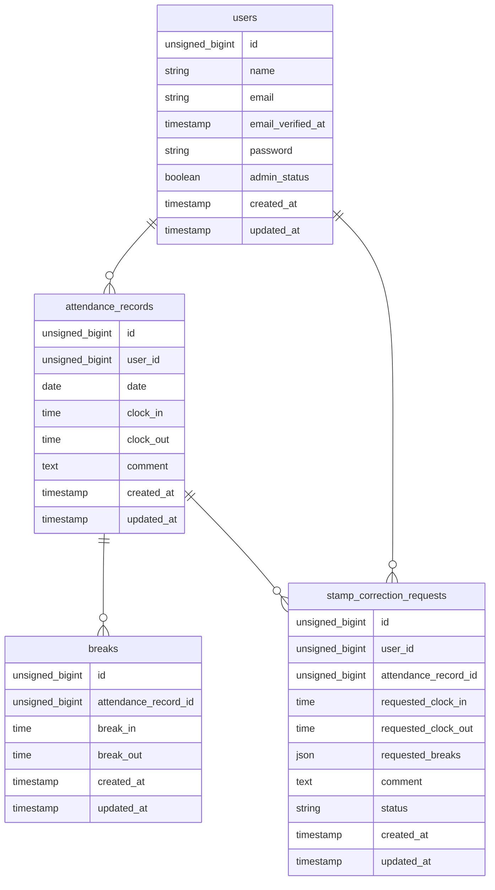

# coachtech-attendance

このリポジトリは、laravelを使用した 実践学習ターム模擬案件中級＿勤怠管理アプリです。

## 作成者

松井 由美子

## 使用技術

- フレームワーク：Laravel 12.x
- 言語          ： PHP 8.2
- Webサーバー   ： Nginx
- データベース  ： MySQL 8.0
- コンテナ管理  ： Docker Compose
- DB管理ツール  ： phpMyAdmin
- メールテスト  ： MailHog

## ER図



## 開発環境URL

- http://localhost/
- phpMyAdmin：http://localhost:8080/
- メール確認URL (Mailhog): http://localhost:8025/

## テスト用ログイン情報

### 一般ユーザー
- **ユーザー1（メール認証済み）**
  - メールアドレス: `user1@example.com`
  - パスワード: `password`
- **ユーザー2 (メール認証済み)**
  - メールアドレス: `user2@example.com`
  - パスワード: `password`

### 管理者ユーザー
- **ユーザー3（admin_status=true）**
  - メールアドレス: `user3@example.com`
  - パスワード: `password`


## 動作環境

- OS: Windows 11 (WSL2 / Ubuntu)
- Docker Desktop


## 環境構築手順

1. **リポジトリをクローン**

    ```bash
    git clone git@github.com:koko-chii/coachtech-attendance.git
    ```

2. **プロジェクトディレクトリへ移動**

    ```bash
    cd coachtech-attendance/src
    ```

3. **.env ファイルの作成**

    ```bash
    cp .env.example .env
    ```

4. **.env ファイルの編集**

    ```bash
    DB_CONNECTION=mysql
    DB_HOST=db
    DB_PORT=3306
    DB_DATABASE=coachtech_attendance
    DB_USERNAME=root
    DB_PASSWORD=root_password
    ```

5. **Docker Composeディレクトリへ移動**

    ```bash
    cd ..
    ```

6. **コンテナの起動**

    ```bash
    docker compose up -d --build
    ```

7. **Composerパッケージをインストール**

    ```bash
    docker compose exec php composer install
    ```

8. **アプリケーションキーの生成**

    ```bash
    docker compose exec php php artisan key:generate
    ```

9. **マイグレーション・シーディングを実行**

    ```bash
    docker compose exec php php artisan migrate:fresh --seed
    ```

> **補足**
>
> docker compose up -d --build を実行すると、node コンテナで npm install と Vite開発サーバー（npm run dev）が自動的に実行されます。そのため、追加で npm install や npm run dev を実行する必要はありません。

## テスト実行

```bash
docker compose exec php php artisan test
```

## 機能一覧

- **スタッフ認証・メール認証** 新規会員登録、ログイン・ログアウト、Mailhog連携による認証制限
- **勤怠登録** スタッフユーザーは自身の出勤時刻・退勤時刻・休憩開始時刻・休憩終了時刻の打刻ができる
- **勤怠一覧の確認** スタッフユーザーは自身の勤怠月情報を確認できる
- **勤怠詳細の確認、修正申請機能** スタッフユーザーは自身の勤怠詳細を確認・修正申請ができる
- **申請一覧からの確認** スタッフユーザーは自身の修正申請一覧から承認待ち・承認済みを確認できる
- **勤怠レポートの確認** スタッフユーザーはマイ勤怠レポートを確認できる

- **管理者のログイン認証** 管理者は管理者機能にログイン・ログアウトができる
- **管理者用勤怠一覧の確認** 管理者は日にち毎のスタッフ勤怠情報を確認できる
- **管理者用勤怠詳細の確認・修正** 管理者は勤怠詳細の確認と、打刻時刻を直接修正できる
- **スタッフ一覧の勤怠情報確認** 管理者はスタッフ一覧からスタッフの勤怠情報を確認できる
- **スタッフ毎の勤怠情報確認**管理者はスタッフ一覧の詳細からスタッフ毎の勤怠情報を確認・csv出力ができる
- **管理者用申請一覧の確認機能** 管理者は申請一覧から修正の承認待ち・承認済みの勤怠情報が確認できる
- **勤怠修正申請の承認機能** 管理者は申請された勤怠修正情報を承認できる


## APIエンドポイント一覧
外部アプリケーションから勤怠データを取得・操作できるエンドポイントを提供しています。
読み取り系（GET）は認証不要、書き込み系（POST / PUT / DELETE）は Laravel Sanctum 認証必須 で、
PUT / DELETE は AttendanceRecordPolicy による認可（本人または管理者のみ操作可）が適用されます。

| HTTPメソッド | URI | 概要 |
|---|---|---|
| GET | /api/v1/attendance-records | 勤怠一覧を取得 |
| GET | /api/v1/attendance-records/{attendanceRecord} | 勤怠詳細を取得 |
| POST | /api/v1/attendance-records | 勤怠を新規登録 |
| PUT | /api/v1/attendance-records/{attendanceRecord} | 勤怠情報を更新 |
| DELETE | /api/v1/attendance-records/{attendanceRecord} | 勤怠情報を削除 |

